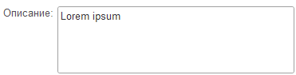
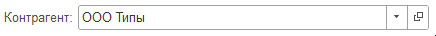
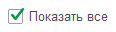
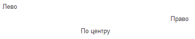
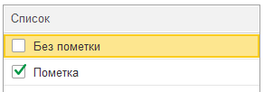
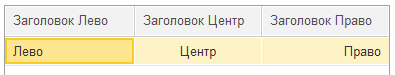
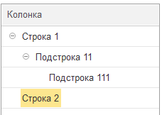

# 
Инструмент для создания прототипов форм 1С:Предприятие 8. Основная идея в том, чтобы можно было быстро набросать форму, показать заказчику, а после использовать ее для написания сценариев BDD.

> [!IMPORTANT] 
> Это ранняя версия проекта. Синтаксис языка пока не стабилен и будет меняться.

# Синтаксис

## Поле надписи
```
Надпись {ИмяСвойства = ЗначениеСвойства}
```
Добавляет декорацию **Надпись** на форму. 
```
Зеленый текст {ЦветТекста = Зеленый}
```


Для элемента доступны теги [горизонтального положения](#горизонтальное-положение).

Доступные свойства:
- ЦветТекста
- ЦветФона

## Поле ввода
```
Заголовок: Значение__.vox.^ {ИмяСвойства = ЗначениеСвойства}
          __________
```
Добавляет поле ввода на форму. 
```
Фамилия: Иванов
```


Для добавления многострочного поля добавьте `___` на следующую строку. Количество таких строк определит высоту поля.
```
Описание: Lorem ipsum
          __________
          __________
```


Для добавления кнопок на поле ввода используйте следующие модификаторы:

Модификатор|Описание
---|---
v| Кнопка выбора
o| Кнопка открытия
x| Кнопка очистки
.| Кнопка выбора из списка
^| Кнопка регулирования

```
Контрагент: ООО Типы__vo
```


Для элемента доступны теги [горизонтального положения](#горизонтальное-положение).

## Поле флажка
```
[X] Флажок {ИмяСвойства = ЗначениеСвойства}
```
или</br>
```
Флажок [] {ИмяСвойства = ЗначениеСвойства}
```
Добавляет поле флажка на форму.

Для признака отметки можно использовать любой символ внутри скобок, при форматировании он будет преобразован в `X`.
```
[X] Показать все
```


Для элемента доступны теги [горизонтального положения](#горизонтальное-положение).

## Командная панель
```
<Кнопка 1| Кнопка 2 {ИмяСвойстваКнопки = ЗначениеСвойстваКнопки}>
```
Добавляет кнопки (командную панель) на форму.

На кнопках можно использовать картинки из библиотеки картинок. Добавьте кнопку нажав на кнопку **Добавить картинку** на командной панели или введите имя картинки с префиксом `@`.
```
< Записать и закрыть {КнопкаПоУмолчанию = Истина} | Записать | Провести | @Печать Печать >
```


Для элемента доступны теги [горизонтального положения](#горизонтальное-положение).

## Горизонтальное положение
Выравнивает элемент в пределах группы.

```
Лево
->                          Право
->          По центру          <-
```

## Таблица
```
| Колонка 1   | Колонка 2   |
| ----------- | ----------- |
| Ячейка 1.1. | Ячейка 1.2. |
| Ячейка 2.1. | Ячейка 2.2. |
```
Добавляет таблицу на форму. 

Можно добавить колонку с флажками, используя символы `[ ]`. 
```
| Список          |
| --------------- |
| [ ] Без пометки |
| [X] Пометка     |
```


Управляйте горизонтальным выравниванием ячеек, добавляя символ `:` в заголовок таблицы.
```
| Заголовок Лево | Заголовок Центр | Заголовок Право |
| -------------- | :-------------: | --------------: |
| Лево           |      Центр      |           Право |
```


Можете также представить данные в виде дерева. Глубина уровней дерева будет определяться количеством точек `.` в начале каждой строки.

```
| Колонка          |
| ---------------- |
| Строка 1         |
| . Подстрока 11   |
| .. Подстрока 111 |
| Строка 2         |
```


## Однострочная группа
```
Элемент 1 & Элемент 2
```
Если нужно расположить несколько элементов в одной строке, используйте однострочную группу.

```
Номер: 000001 & от: 01.01.2025
```

## Группа
```
#Заголовок группы 1   #Заголовок группы 2
Элемент группы 1      +   Элемент группы 2
```

 Группы позволяют выстраивать элементы на форме один под другим. 

```
#Флажки        #Поля ввода
[ ] Флажок 1   +   Поле ввода 1:
[ ] Флажок 2   +   Поле ввода 2:
[ ] Флажок 3   +   Поле ввода 3:
```


Можно добавлять вложенные группы.
```
#                  #
Дата: 01.01.2025   +   Контрагент: Иванов__v
Номер: 1           +   Договор: №1__v
                   +   #Остаток на 01.01   #Остаток на 01.02
                   +   Сумма: 100          +   Сумма: 200
```


## Страницы
```
/Страница 1

	Элемент 1

/Страница 2

	Элемент 2
```
Добавляет страницы на форму.


# Пример
```
< Записать и закрыть {КнопкаПоУмолчанию = Истина} | Записать | @Печать Печать >

/Общее

	Подготовил: Иванов Иван Иванович__vo
	Ответственный: Петров Петр Петрович__vo
	Подразделение: Департамент развития__vo
	Описание: Приобретение ПО (10 лицензий)
	          _____________________________

/Финансирование

	Источник финансирования: Средства от приносящей доход деятельности__vo
	Обоснование необходимости: Возникла необходимость в кратчайшие сроки установить 10 лицензий на рабочие места сотрудников
	                           _____________________________________________________________________________________________

	| Статья расходов                                |    Остаток | 2025 | 2026 | 2027 |
	| ---------------------------------------------- | ---------: | ---: | ---: | ---: |
	| Услуги в области информационно-вычислительных  | 1976329,69 |    0 |    0 |    0 |
	| . Информационный модуль сайта                  |  1000000,0 |    0 |    0 |    0 |
	| . Оказание услуг по внедрению продукта системы |  976329,69 |    0 |    0 |    0 |


/Описание предмета закупки

	Предмет закупки: Лицензия на право использования ПО
	Закон: 223-ФЗ__v
	Способ закупки: Закупка у единственного поставщика (подрядчика, исполнителя)__vo

/Обработка


	| Сотрудники            | Состояние  |
	| --------------------- | ---------- |
	| Сидоров Иван Петрович | Согласован |
```