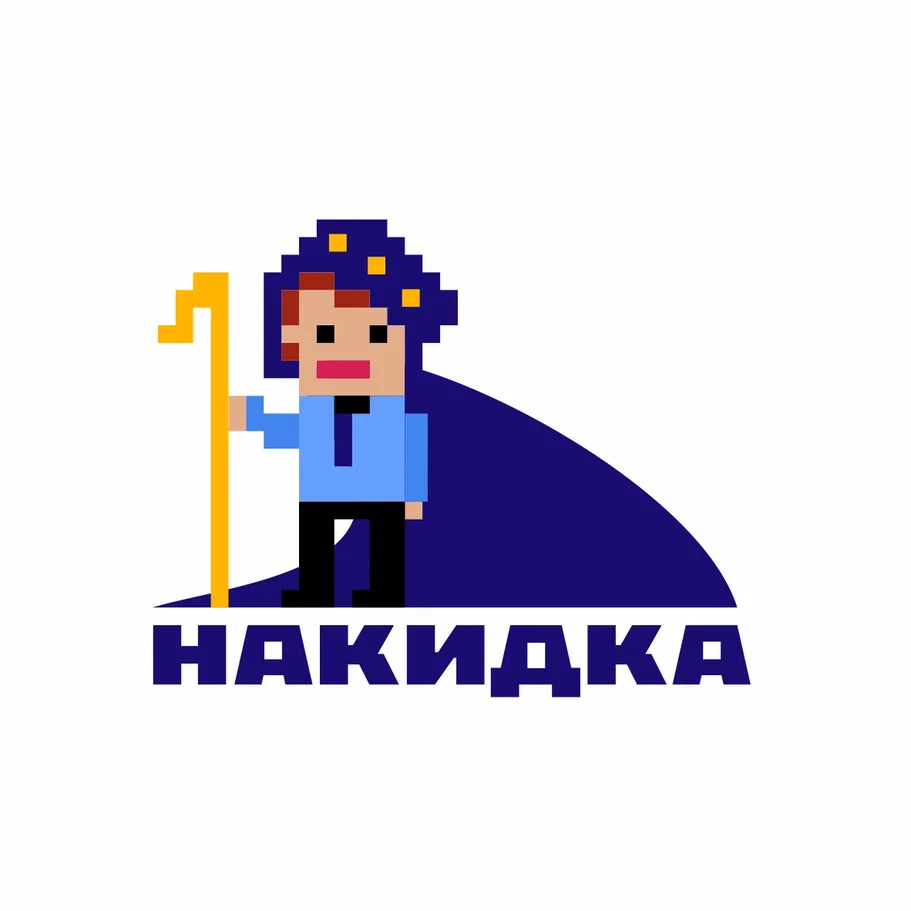
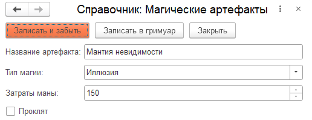

<p align="center">
  <a href="https://crimsongoldteam.github.io/md_design">
    
  </a>
</p>

<p align="center">
  <a href="https://openyellow.org/grid?data=top&repo=892746188">
    
  </a>
  <a href="https://github.com/crimsongoldteam/md_design/releases/latest">
    
  </a>
  <a href="https://github.com/crimsongoldteam/md_design/releases/latest">
     
  </a>  
  <a href="https://github.com/crimsongoldteam/md_design/blob/main/LICENSE.md">
    
  </a>
  <a href="https://t.me/overlay1c">
    
  </a>

</p>

Накидка — это инструмент для 1С:Предприятие 8, который позволяет быстро создавать формы по текстовому описанию. Он использует простой и понятный синтаксис, напоминающий Markdown, а также поддерживает визуальное проектирование элементов интерфейса.

А еще можно сказать, что превращает это:

```text
--- Справочник: Магические артефакты ---

< Записать и забыть {ЦветФона = Коралловый} | Записать в гримуар| Закрыть >

Название артефакта: Мантия невидимости
Тип магии: Иллюзия__С
Затраты маны: 150__Д

[ ] Проклят
```

Вот в это:

<div align="center">
    
</div>

и обратно!

## 🎯Кому пригодится?

📌 **Аналитикам**

- Быстрое создание прототипов с помощью силы Искусственного интеллекта
- Наглядная визуализация будущего интерфейса на ранних этапах для согласования с заказчиком

📌 **Разработчикам**

- Создание форм, соответствующих стандартам 1С и рекомендациям сообщества
- Экспорт прототипов в конфигурацию
- Автоматическая генерация кода программного создания реквизитов

📌 **Тестировщикам**

- Создание тестовых сценариев уже на этапе проектирования - до разработки самой формы

## 🚀Быстрый старт

Ознакомьтесь с кратким [руководством по началу работы](https://crimsongoldteam.github.io/md_design/#/БыстрыйСтарт).

## 📚Документация

[Полная документация проекта доступна на нашем сайте.](https://crimsongoldteam.github.io/md_design)

Видеодемонстрация [YouTube](https://youtu.be/nhJveZRSHao), [VK Video](https://vkvideo.ru/video-227129566_456239051)

## [](https://infostart.ru/1c/tools/2304023/)

- Обзорная статья: [От слов к формам: разработка интерфейса по текстовому описанию](https://infostart.ru/1c/tools/2304023/).

- Сквозной пример: [Мастерим формы с искусственным интеллектом](https://infostart.ru/1c/articles/2331345/).

## 🤝Поучаствовать в развитии проекта

Если у вас есть идея, которая может улучшить проект, или вы заметили что-то, что можно сделать лучше, поделитесь этим в разделе [issues](https://github.com/crimsongoldteam/md_design/issues).

Если вы хотите реализовать свою идею или исправить ошибку, ознакомьтесь со статьей [CONTRIBUTING](CONTRIBUTING.md). Мы всегда рады pull request'ам!

Благодарим всех, кто принимает участие в развитии проекта: ([emoji key](https://allcontributors.org/docs/ru/emoji-key)):

<!-- ALL-CONTRIBUTORS-LIST:START - Do not remove or modify this section -->
<!-- prettier-ignore-start -->
<!-- markdownlint-disable -->
<table>
  <tbody>
    <tr>
      <td align="center" valign="top" width="14.28%"><a href="https://github.com/nikitazherebtsov"><br /><sub><b>Nikita Zherebtsov</b></sub></a><br /><a href="#code-nikitazherebtsov" title="Code">💻</a></td>
      <td align="center" valign="top" width="14.28%"><a href="https://github.com/naumovare"><br /><sub><b>Regina Naumova</b></sub></a><br /><a href="#doc-naumovare" title="Documentation">📖</a> <a href="#bug-naumovare" title="Bug reports">🐛</a></td>
      <td align="center" valign="top" width="14.28%"><a href="https://github.com/TkachenkoPI"><br /><sub><b>Pavel Tkachenko</b></sub></a><br /><a href="#code-TkachenkoPI" title="Code">💻</a></td>
      <td align="center" valign="top" width="14.28%"><a href="https://t.me/alei1180"><br /><sub><b>Alexander Osadchy</b></sub></a><br /><a href="#doc-alei1180" title="Documentation">📖</a></td>
      <td align="center" valign="top" width="14.28%"><a href="https://github.com/karamazoffm"><br /><sub><b>karamazoffm</b></sub></a><br /><a href="#ideas-karamazoffm" title="Ideas, Planning, & Feedback">🤔</a></td>
      <td align="center" valign="top" width="14.28%"><a href="http://pinkycat.ru"><br /><sub><b>Gleb Bogachev</b></sub></a><br /><a href="#bug-pinkycat" title="Bug reports">🐛</a></td>
      <td align="center" valign="top" width="14.28%"><a href="https://github.com/d-hurricane"><br /><sub><b>Урянский Денис</b></sub></a><br /><a href="#ideas-d-hurricane" title="Ideas, Planning, & Feedback">🤔</a></td>
    </tr>
    <tr>
      <td align="center" valign="top" width="14.28%"><a href="https://github.com/shuricks"><br /><sub><b>Alexander</b></sub></a><br /><a href="#bug-shuricks" title="Bug reports">🐛</a></td>
      <td align="center" valign="top" width="14.28%"><a href="https://github.com/GorbatkoMD"><br /><sub><b>Максим</b></sub></a><br /><a href="#bug-GorbatkoMD" title="Bug reports">🐛</a></td>
      <td align="center" valign="top" width="14.28%"><a href="https://github.com/thequb1k"><br /><sub><b>Dmitry Baraboy</b></sub></a><br /><a href="#bug-thequb1k" title="Bug reports">🐛</a></td>
      <td align="center" valign="top" width="14.28%"><a href="https://github.com/Untru"><br /><sub><b>Pavel</b></sub></a><br /><a href="#code-Untru" title="Code">💻</a></td>
      <td align="center" valign="top" width="14.28%"><a href="https://telegra.ph/sergsyp-10-03"><br /><sub><b>Sergey Sypachev</b></sub></a><br /><a href="#promotion-sergsyp" title="Promotion">📣</a></td>
    </tr>
  </tbody>
</table>

<!-- markdownlint-restore -->
<!-- prettier-ignore-end -->

<!-- ALL-CONTRIBUTORS-LIST:END -->

Этот проект следует спецификации [all-contributors](https://allcontributors.org).

👍 При разработке использовался список картинок из статьи [Диалог выбора картинки из библиотеки картинок](https://infostart.ru/1c/tools/1522958).

👍 Парсинг осуществляется с помощью библиотеки [Сhevrotain](https://github.com/chevrotain/chevrotain).

👍 Иконки взяты из коллекций [HackerNoon's Pixel Icon Library](https://pixeliconlibrary.com), [Lucid Icons](https://leo-red.itch.io/lucid-icon-pack) и [Remix Icon](remixicon.com).

## ⚖️Лицензии

[MIT](LICENSE.md)
