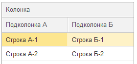

# Накидка
[](https://openyellow.org/grid?data=top&repo=892746188)


Создание прототипов форм 1С:Предприятие 8 при помощи markdown-подобного языка
Идея в том, что аналитик может быстро сделать форму, показать заказчику и сразу использовать для написания BDD-сценариев, не дожидаясь разработчика.
Макет формы создается по текстовому описанию.

> [!IMPORTANT] 
> Это ранняя версия проекта. Синтаксис языка пока не стабилен и будет меняться.

## Установка
1. Скачайте свежую версию обработки **MDDesign.epf** со страницы [релизов](https://github.com/crimsongoldteam/md_design/releases).
2. Откройте ее в режиме 1С.Предприятие.
## Использование


Используйте поле редактора для написания прототипа формы. Описание языка в разделе [Синтаксис](#синтаксис).

Чтобы увидеть, что получилось нажмите **Сформировать**.

Кнопка **Форматировать** делает текст более читаемым.

## Синтаксис

### Заголовок
```
--- Заголовок формы ---
```
В начале описания прототипа добавьте заголовок формы. Этот заголовок будет отображаться при открытии формы в отдельном окне.

### Поле надписи
```
Надпись {ИмяСвойства = ЗначениеСвойства}
```
Добавляет декорацию **Надпись** на форму. 
```
Зеленый текст {ЦветТекста = Зеленый}
```


Для элемента доступны теги [горизонтального положения](#горизонтальное-положение).

Доступные свойства:
- ЦветТекста
- ЦветФона

### Поле ввода
```
Заголовок: Значение__ВСХОД {ИмяСвойства = ЗначениеСвойства}
          __________
```
Добавляет поле ввода на форму. 
```
Фамилия: Иванов
```


#### Многострочное поле ввода
Для добавления многострочного поля добавьте `___` на следующую строку. Количество таких строк определит высоту поля.
```
Описание: Lorem ipsum
          _________
          _________
```


#### Кнопки поля ввода
Для добавления кнопок на поле ввода используйте следующие модификаторы:

| Модификатор |  Описание             |
| ----------- |  -------------------- |
| В           |  Кнопка выбора        |
| С           |  Кнопка списка        |
| Х           |  Кнопка очистки       |
| О           |  Кнопка открытия      |
| Д           |  Кнопка регулирования |


```
Контрагент: ООО Типы__СО
```


Для элемента доступны теги [горизонтального положения](#горизонтальное-положение).

### Поле флажка
```
[X] Флажок {ИмяСвойства = ЗначениеСвойства}
```
или</br>
```
Флажок [] {ИмяСвойства = ЗначениеСвойства}
```
Добавляет поле флажка на форму.

Для признака отметки можно использовать любой символ внутри скобок, при форматировании он будет преобразован в `X`.
```
[X] Показать все
```


#### Выключатель
Вместо флажка можно использовать выключатель. Для отображения состояний флажка можно использовать любые символы, разделенные символом "|". Символ слева от разделителя соответствует *выключено*, а справа — *включено*.
```
[0| ] Выключено
[ |1] Включено
```


Для элемента доступны теги [горизонтального положения](#горизонтальное-положение).

### Командная панель
```
{ИмяСвойства = ЗначенияСвойства}
<Кнопка 1| Кнопка 2 {ИмяСвойстваКнопки = ЗначениеСвойстваКнопки} | - | Меню
Меню
.Подменю>
```
Добавляет кнопки (командную панель) на форму.

#### Картинки в командной панели

На кнопках можно использовать картинки из библиотеки картинок. Добавьте кнопку нажав на кнопку **Добавить картинку** на командной панели или введите имя картинки с префиксом `@`.
```
< Записать и закрыть {КнопкаПоУмолчанию = Истина} | Записать | Провести | @Печать Печать >
```


#### Меню
Добавляйте меню на командную панель. Разделяйте кнопки визуально с помощью `-`. Этот же символ используйте для разделения пунктов меню.
```
<Записать |-| Печать 
Печать 
. Акт
. Счет
.. Счет на оплату
.. -
.. Счет на оплату (с факсимиле)>
```


Для элемента доступны теги [горизонтального положения](#горизонтальное-положение).

### Горизонтальное положение
Выравнивает элемент в пределах группы.

```
Лево
->                          Право
->          По центру          <-
```

### Таблица
```
| Колонка 1   | Колонка 2   |
| ----------- | ----------- |
| Ячейка 1.1. | Ячейка 1.2. |
| Ячейка 2.1. | Ячейка 2.2. |
```
Добавляет таблицу на форму. 

#### Флажки в таблице

Можно добавить колонку с флажками, используя символы `[ ]`. 
```
| Список          |
| --------------- |
| [ ] Без пометки |
| [X] Пометка     |
```


#### Горизонтальное выравнивание ячеек

Управляйте горизонтальным выравниванием ячеек, добавляя символ `:` в заголовок таблицы.
```
| Заголовок Лево | Заголовок Центр | Заголовок Право |
| -------------- | :-------------: | --------------: |
| Лево           |      Центр      |           Право |
```


#### Дерево
Можете также представить данные в виде дерева. Глубина уровней дерева будет определяться количеством точек `.` в начале каждой строки.

```
| Колонка          |
| ---------------- |
| Строка 1         |
| . Подстрока 11   |
| .. Подстрока 111 |
| Строка 2         |
```


#### Многострочные заголовки
Добавляйте многострочные заголовки.
```
| -Колонка-                  ||
| Подколонка А | Подколонка Б |
| ------------ | ------------ |
| Строка А-1   | Строка Б-1   |
| Строка А-2   | Строка Б-2   |
```


Это также можно использовать для строк в таблице.
```
| Колонка                    ||
| Подколонка А | Подколонка Б |
| ------------ | ------------ |
| Строка 1                   ||
| Строка А-1   | Строка Б-1   |
| Строка 2                   ||
| Строка А-2   | Строка Б-2   |
```


#### Редактор таблицы
Добавляйте и изменяйте состав колонок с помощью редактора.


При помощи редактора вы можете добавлять, перемещать и удалять колонки. Настраивать горизонтальное положение текста ячеек, устанавливать признак [групп колонок](#многострочные-заголовки).


### Однострочная группа
```
Элемент 1 & Элемент 2
```
Если нужно расположить несколько элементов в одной строке, используйте однострочную группу.

```
Номер: 000001 & от: 01.01.2025
```

### Группа
```
#Заголовок группы 1   #Заголовок группы 2
Элемент группы 1      +   Элемент группы 2
```

 Группы позволяют выстраивать элементы на форме один под другим. 

```
#Флажки        #Поля ввода
[ ] Флажок 1   +   Поле ввода 1:
[ ] Флажок 2   +   Поле ввода 2:
[ ] Флажок 3   +   Поле ввода 3:
```


Можно добавлять вложенные группы.
```
#                  #
Дата: 01.01.2025   +   Контрагент: Иванов__С
Номер: 1           +   Договор: №1__С
                   +   #Остаток на 01.01   #Остаток на 01.02
                   +   Сумма: 100          +   Сумма: 200
```


### Страницы
```
/Страница 1

	Элемент 1

/Страница 2

	Элемент 2
```
Добавляет страницы на форму. Элементы внутри страниц отделяются знаком табуляции.
Допускаются вложенные друг в друга страницы


## Пример
```
--- Служебная записка ---
< Записать и закрыть {КнопкаПоУмолчанию = Истина} | Записать |  - | @Печать Печать
Печать
. Служебная записка >

/Общее

	Подготовил: Иванов Иван Иванович__СО
	Ответственный: Петров Петр Петрович__СО
	Подразделение: Департамент развития__СО
	Описание: Приобретение ПО (10 лицензий)
	          _____________________________

/Финансирование

	Источник финансирования: Средства от приносящей доход деятельности__СО
	Обоснование необходимости: Возникла необходимость в кратчайшие сроки установить 10 лицензий на рабочие места сотрудников
	                           _____________________________________________________________________________________________

	| Статья расходов                                |     Остаток | -Год-            |||
	|                                                |             | 2025 | 2026 | 2027 |
	| ---------------------------------------------- | ----------: | ---: | ---: | ---: |
	| Услуги в области информационно-вычислительных  |  1976329,69 |    0 |    0 |    0 |
	| . Информационный модуль сайта                  |   1000000,0 |    0 |    0 |    0 |
	| . Оказание услуг по внедрению продукта системы |   976329,69 |    0 |    0 |    0 |

/Описание предмета закупки

	Предмет закупки: Лицензия на право использования ПО
	Закон: 223-ФЗ__С
	Способ закупки: Закупка у единственного поставщика (подрядчика, исполнителя)__СО

/Обработка


	| Сотрудники            | Состояние  |
	| --------------------- | ---------- |
	| Сидоров Иван Петрович | Согласован |
```

## Благодарности
При разработке использовался список картинок из статьи https://infostart.ru/1c/tools/1522958/.

## Лицензии
[MIT](LICENSE.md)
