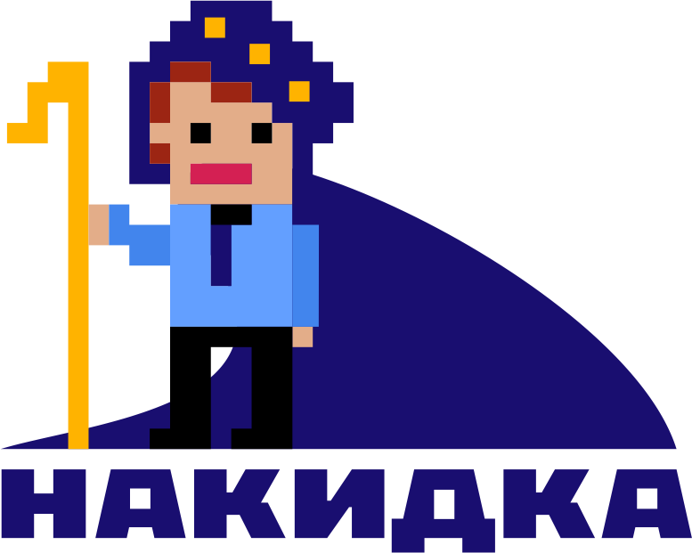

<p align="center">
  <a href="https://crimsongoldteam.github.io/md_design">
    
  </a>
</p>

<p align="center">
  <a href="https://openyellow.org/grid?data=top&repo=892746188">
    
  </a>
  <a href="https://github.com/crimsongoldteam/md_design/releases/latest">
    
  </a>
  <a href="https://github.com/crimsongoldteam/md_design/blob/main/LICENSE.md">
    
  </a>
</p>


*Накидка* — это обработка, позволяющая создавать формы в 1С:Предприятие 8 на основе текстового описания. Используется знакомый синтаксис, похожий на Markdown. Инструмент также предоставляет возможности для визуального проектирования сложных элементов. 

Кому это будет полезно?
- Аналитикам - для создания прототипов;
- Разработчикам - для удобной организации интерфейса и оценки влияния установленных настроек на внешний вид элементов;
- Тестировщикам - для разработки тестов для ещё не существующих форм.

*Накидка* объединяет легкость работы с текстом с удобством графического конструктора.


А еще можно сказать, что она превращает это:

```text
--- Справочник: Магические артефакты ---

< Записать и забыть {ЦветФона = Коралловый} | Записать в гримуар| Закрыть >

Название артефакта: Мантия невидимости
Тип магии: Иллюзия__С
Затраты маны: 150__Д

[ ] Проклят
```

Вот в это:


и обратно!

## Быстрый старт

Ознакомьтесь с кратким [руководством по началу работы](https://crimsongoldteam.github.io/md_design/#/БыстрыйСтарт).

## Документация
Документация расположена по адресу https://crimsongoldteam.github.io/md_design.

## Статьи Инфостарт

[](https://infostart.ru/1c/tools/2304023/)

- Обзорная статья: [От слов к формам: разработка интерфейса по текстовому описанию](https://infostart.ru/1c/tools/2304023/).

- Сквозной пример: [Мастерим формы с искусственным интеллектом](https://infostart.ru/1c/articles/2331345/).

## Поучаствовать в развитии проекта
Если у вас есть идея, которая может улучшить проект, или вы заметили что-то, что можно сделать лучше, поделитесь этим в разделе [issues](https://github.com/crimsongoldteam/md_design/issues). 

Если вы хотите реализовать свою идею или исправить ошибку, ознакомьтесь со статьей [CONTRIBUTING](CONTRIBUTING.md). Мы всегда рады pull request'ам!

<!-- ALL-CONTRIBUTORS-LIST:START - Do not remove or modify this section -->
<!-- prettier-ignore-start -->
<!-- markdownlint-disable -->

<!-- markdownlint-restore -->
<!-- prettier-ignore-end -->

<!-- ALL-CONTRIBUTORS-LIST:END -->

## Благодарности
- При разработке использовался список картинок из статьи [Диалог выбора картинки из библиотеки картинок](https://infostart.ru/1c/tools/1522958).
- Парсинг осуществляется с помощью библиотеки [Сhevrotain](https://github.com/chevrotain/chevrotain).

## Лицензии
[MIT](LICENSE.md)
