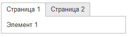

# Страницы
```text
/Страница 1

    Элемент 1

/Страница 2

    Элемент 2
```
Добавляет страницы на форму. Элементы внутри страниц отделяются знаком табуляции.
Допускаются вложенные друг в друга страницы

<kbd>  </kbd> 