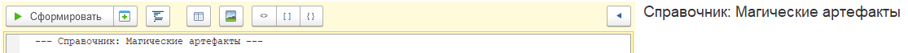

# Быстрый старт

## Установка
1. Скачайте свежую версию обработки **Накидка.epf** со страницы [релизов](https://github.com/crimsongoldteam/md_design/releases).
2. Откройте ее в режиме 1С.Предприятие.

## Знакомство с интерфейсом

Введите текст в редакторе (поле ввода справа), а затем нажмите **Сформировать**, чтобы увидеть получившийся результат на панели справа.

Используйте кнопку **Форматировать** для автоматического выравнивания кода.

Больше информации есть в разделе **Интерфейс**.

## Пример использования

Начните с указания заголовка формы, введите следующий текст в редакторе, затем нажмите **Сформировать**:

```text
--- Контрагенты ---
```

<kbd>  </kbd> 


Попробуйте добавить поле ввода, добавив текст на следующую строку:

```text
Наименование: ООО Типы
```

<kbd>  </kbd> 

Заголовок поля ввода отделяется от значения символом `:`.

К полю ввода можно добавить кнопки, например, `С` — кнопка списка, `Х` — очистка, они добавляются через `__`.

```text
Наименование: ООО Типы
Основной договор: №1__СХ
```

<kbd>  </kbd> 


Менять значение для поля ввода можно сразу в результате, например, поменяйте значение поля ввода на "№1 от 07.02.2025" и нажмите **Заполнить из формы**. Это будет особенно полезно для работы с таблицами.

<kbd>  </kbd> 

Таблицы в "Накидке" выглядят так: 

```text
| Дата       | Сумма |
| ---------- | ----- |
| 01.01.2025 | 100   |
| 02.01.2025 | 150   |
```

Нажмите на кнопку Редактор таблицы и в окне введите две строки с заголовками "Дата" и "Сумма". Нажмите "OK" и сформируйте форму.

В правой части окна появится таблица, добавьте в нее пару строк. Нажмите кнопку **Заполнить из формы**.

<kbd>  </kbd> 

Что еще можно сделать:

Добавляйте флажки, используя квадратные скобки `[]`
```text
[] Это покупатель
```

Используйте `#` описания заголовков групп, а `+` для разделения их содержимого:
```text
#Информация о контрагенте   #Основной договор
Наименование: ООО Типы      +   Договор: №1__СХ
ИНН: 736881427170           +   [X] Это покупатель
```

Распределяйте содержание формы по страницам (не забывайте нажимать Tab на клавиатуре, чтобы отделять содержимое групп):
```text
/Информация о контрагенте
	Наименование: ООО Типы
	ИНН: 736881427170

/Основной договор
	Договор: №1__СХ
```

Подробное описание каждого элемента вы можете найти в разделе **Синтаксис**.

 


