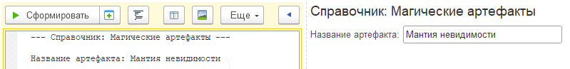
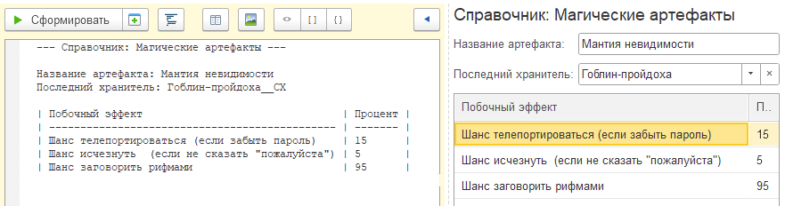

# Быстрый старт

## Установка
1. Скачайте свежую версию обработки **Накидка.epf** со страницы [релизов](https://github.com/crimsongoldteam/md_design/releases).
2. Откройте ее в режиме 1С.Предприятие.

## Знакомство с интерфейсом

Введите текст в редакторе (поле ввода справа), а затем нажмите **Сформировать**, чтобы увидеть получившийся результат на панели справа.

Используйте кнопку **Форматировать** для автоматического выравнивания кода.

Больше информации есть в разделе **Интерфейс**.

## Пример использования

 - Начните с указания заголовка формы, введите следующий текст в редакторе, затем нажмите **Сформировать**:

```text
--- Справочник: Магические артефакты ---
```

<kbd>  </kbd> 


- Попробуйте добавить поле ввода. Заголовок поля ввода отделяется от значения символом `:`. Добавив текст на следующую строку:

```text
Название артефакта: Мантия невидимости
```

<kbd>  </kbd> 


 - К полю ввода можно добавить кнопки, например, `С` — кнопка списка, `Х` — очистка, они добавляются через `__`.

```text
Последний хранитель: Владыка Всех Земель__СХ
```

<kbd>  </kbd> 

- Менять значение для поля ввода можно сразу в результате, например, поменяйте значение поля ввода другое значение, например, "Гоблин-пройдоха" и нажмите **Заполнить из формы**. Это будет особенно полезно для работы с таблицами.

<kbd>  </kbd> 

- Добавьте таблицу. Нажмите на кнопку **Редактор таблицы** и в окне введите две строки с заголовками "Побочный эффект" и "Процент". Нажмите "OK" и сформируйте форму.

- В правой части окна появится таблица, добавьте в нее пару-тройку строк. Нажмите кнопку **Заполнить из формы**.

<kbd>  </kbd> 

- Поздравляем, первый прототип готов!

## Что можно сделать еще

- Добавляйте кнопки, используя квадратные скобки `<>` и разделяя кнопки символом `|`.
 ```text
< Внести в свиток заклинаний | Закрыть >
```

- Добавляйте флажки, используя квадратные скобки `[]`
```text
[] Привлекает кошек
```

- Используйте `#` описания заголовков групп, а `+` для разделения их содержимого:
```text
#Важные характеристики   #Ключевые характеристики
[ ] Призывает дождь      + [X] Меняет цвет
[ ] Говорит              + [ ] Требует подзарядки

```

- Распределяйте содержание формы по страницам (не забывайте нажимать Tab на клавиатуре, чтобы отделять содержимое групп):
```text
/Рецепт грибного пирога
	Далее идет описание вкусного грибного пирога
/Страница, которую не следует открывать смертным
	< Вы попались >
```

Подробное описание каждого элемента вы можете найти в разделе **Синтаксис**.

 


