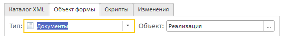

# Выгрузить в конфигурацию

!> При использование возможны ошибки и повреждение конфигурации. Загружайте измененные XML-выгрузки только в копии баз..

Чтобы добавить сформированную форму в конфигурацию, сначала выгрузите её в XML-файлы. Затем добавьте новую форму из Накидки. После этого останется только загрузить обновлённые обратно в конфигурацию.

?> Перед выгрузкой в конфигурацию вы можете автоматически заполнить типы реквизитов в [Дереве реквизитов](ДеревоРеквизитов.md).

## Выгрузка конфигурации в файлы

Определите, куда именно вы хотите добавить новую форму:

- В основную конфигурацию
- В расширение

##### Выгрузка основной конфигурации

1. Откройте **Конфигуратор**.
2. Перейдите в меню "**Конфигурация**" → "**Выгрузить конфигурацию в файлы…**".
3. Укажите папку, куда сохранить XML-файлы, и нажмите "**Выгрузить**".

##### Выгрузка расширения

1. Откройте **Конфигуратор**.
2. В **Конфигураторе** перейдите в "**Конфигурация**" → "**Расширения**".
3. Выберите нужное расширение и в меню **Конфигурация** окна расширения выберите "**Выгрузить конфигурацию в файлы…**".
4. Укажите папку для сохранения и подтвердите выгрузку.

## Экспорт формы из Накидки

1. Откройте окно экспорта

<kbd>  </kbd>

2. На закладке **Каталог XML** укажите папку с выгруженными файлами конфигурации.
3. На закладке **Объект формы** выберите элемент метаданных для добавления формы.

<kbd>  </kbd>

4. На закладке **Скрипты**, загрузите или создайте скрипты постообработки. Более подробно про синтаксис скриптов можно узнать в статье [Скрипты](Скрипты.md).
5. Нажмите кнопку "**Выгрузить**".

## Загрузка изменений в конфигурацию

Загрузка изменений также выполняется в конфигураторе.

##### Загрузка в основную конфигурации

1. Выберите в меню "**Конфигурация**" → "**Загрузить конфигурацию из файлов…**".
2. Укажите папку, куда сохраняли XML-файлы, и нажмите "**Загрузить**".
3. Сохраните и обновите конфигурацию.

##### Загрузка в расширение

1. В окне расширений выберите нужное расширение и в меню **Конфигурация** окна расширения выберите "**Загрузить конфигурацию из файлов…**".
2. Укажите папку, куда сохраняли XML-файлы, и нажмите "**Загрузить**".
3. Сохраните и обновите конфигурацию.

## Известные ограничения

[Открытые задачи по экспорту в XML на github.com](https://github.com/crimsongoldteam/md_design/issues?q=is%3Aissue%20state%3Aopen%20label%3A%22%D1%8D%D0%BA%D1%81%D0%BF%D0%BE%D1%80%D1%82%20xml%22)
