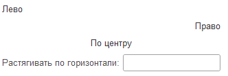

## Горизонтальное положение

С помощью символов `->` и `<-` можно управлять горизонтальным выравниванием элементов.

```text
Лево
->                          Право
->          По центру          <-
Растягивать по горизонтали:     ->
```

<kbd>  </kbd>
