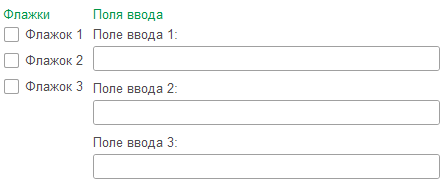
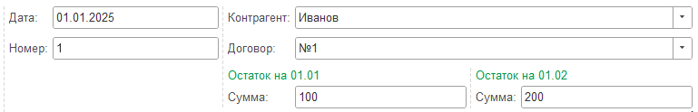

# Группы

## Группа
```text
#Заголовок группы 1   #Заголовок группы 2
Элемент группы 1      +   Элемент группы 2
```

 Группы позволяют выстраивать элементы на форме один под другим. 

```text
#Флажки        #Поля ввода
[ ] Флажок 1   +   Поле ввода 1:
[ ] Флажок 2   +   Поле ввода 2:
[ ] Флажок 3   +   Поле ввода 3:
```
<kbd>  </kbd> 

Можно добавлять вложенные группы.
```text
#                  #
Дата: 01.01.2025   +   Контрагент: Иванов__С
Номер: 1           +   Договор: №1__С
                   +   #Остаток на 01.01   #Остаток на 01.02
                   +   Сумма: 100          +   Сумма: 200
```
<kbd>  </kbd> 


## 🆕 Отображение и поведение
Можете изменить внешний вид группы и ее заголовка, добавив дополнительные символы `#`. Например:
```text
######Всплывающая
[ ] Флажок
```
<kbd>  </kbd> 

| № | Синтаксис | Отображение | Поведение    |
|---|-----------|-------------|--------------|
| 1 | #         | Нет         | Нет          |
| 2 | ##        | Слабое      | Нет          |
| 3 | ###       | Обычное     | Нет          |
| 4 | ####      | Сильное     | Нет          |
| 5 | #####     | Обычное     | Свертываемая |
| 6 | ######    | Обычное     | Всплывающая  |

## Однострочная группа
```
Элемент 1 & Элемент 2
```
Если нужно расположить несколько элементов в одной строке, используйте однострочную группу.

```text
Номер: 000001 & от: 01.01.2025
```
<kbd>  </kbd> 

## Свойства вертикальных групп

| Свойство                | 
| ----------------------- | 
| Заголовок | 
| Отображение |
| Поведение |