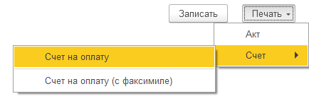

# Кнопки

## Командная панель

```text
{ИмяСвойства = ЗначенияСвойства}
< Кнопка 1| Кнопка 2 {ИмяСвойстваКнопки = ЗначениеСвойстваКнопки} >
```

Добавляет кнопки (командную панель) на форму.

?> Если в описании присутствует только одна кнопка, она будет отображена без командной панели.

## Картинки в командной панели

На кнопках можно использовать картинки из библиотеки картинок. Добавьте кнопку нажав на кнопку **Добавить картинку** на командной панели или введите имя картинки с префиксом `@`.

```text
< Записать и закрыть {КнопкаПоУмолчанию = Истина} | Записать | Провести | @Печать Печать >
```

<kbd>  </kbd>

## Меню

Добавляйте меню на командную панель. Разделяйте кнопки визуально с помощью `-`. Этот же символ используйте для разделения пунктов меню.

!> С версии 0.12.1 кнопки, идущие после разделителя меню (`-`), нужно явно включать в группу. Для этого перед каждой кнопкой добавьте дополнительную `.`

```text
<Записать |-| Печать
Печать
. Акт
. Счет
.. Счет на оплату
.. -
... Счет на оплату (с факсимиле)>
```

<kbd>  </kbd>

Для элемента доступны теги [горизонтального положения](ГоризонтальноеПоложение.md).
