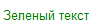

# Надпись
```text
Надпись {ИмяСвойства = ЗначениеСвойства}
```
Добавляет декорацию **Надпись** на форму. 
```text
Зеленый текст {ЦветТекста = Зеленый}
```
<kbd>  </kbd> 

## Свойства

| Свойство                       |
| ------------------------------ |
| Заголовок                      |
| ЦветФона                       |
| ЦветТекста                     |
| ГоризонтальноеПоложениеВГруппе |
| РастягиватьПоГоризонтали       |

Для элемента доступны теги [горизонтального положения](ГоризонтальноеПоложение.md).

