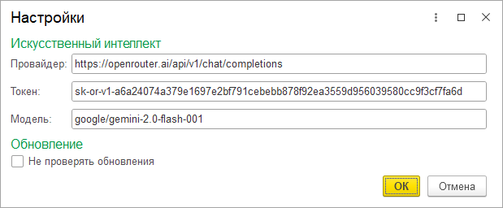

# Настройки

?> Форма настроек доступна через справочную панель. Если панель не отображается, нажмите кнопку "?", чтобы открыть её.

* **Искуственный интеллект.** Если не заполнить, будет обращение к тестовому серверу.
1. **Провайдер.** Адрес провайдера ИИ.
2. **Токен.** Токен доступа, предоставляемый провайдером.
3. **Модель.**  Название модели, к которой будут выполняться запросы.
* **Не проверять обновления**. Отключает проверку обновлений при запуске. Ускоряет запуск обработки.