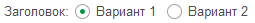
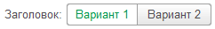

# Переключатель

## Переключатель

```text
Заголовок: (X)Вариант 1 ( )Вариант 2
```

или вариант без заголовка

```text
(X)Вариант 1 ( )Вариант 2
```

Добавляет поле переключателя на форму.

Для признака отметки можно использовать любой символ внутри скобок, при форматировании он будет преобразован в `X`.

<kbd>  </kbd>

## Тумблер

Можно изменить вид переключателя на `Тумблер`

```text
Заголовок: (X)Вариант 1 ( )Вариант 2 {ВидПереключателя = Тумблер}
```

<kbd>  </kbd>

Для элемента доступны теги [горизонтального положения](ГоризонтальноеПоложение.md).
