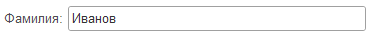
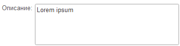
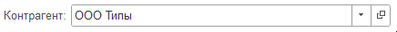

# Поля ввода

## Поле ввода
```text
Заголовок: Значение__ВСХОД {ИмяСвойства = ЗначениеСвойства}
          __________
```
Добавляет поле ввода на форму. 
```text
Фамилия: Иванов
```
<kbd>  </kbd>

## Тип значения

Тип поля ввода определяеся по значению. Например:
```text
Строковое поле: Значение
Числовое поле: 8.5  
Дата: 08.03.2025 
```

| Тип          | Форматы                                                 | Примеры                     | Пустое значение                        |
| ------------ | ------------------------------------------------------- | --------------------------- | -------------------------------------- |
| Дата         | `дд.мм.гггг` или `дд.мм.гг`                             | `01.01.2025`, `01.01.25`    | `01.01.01` или `01.01.0001`            |
| Время        | `ч:мм`, `чч:мм`, `чч:мм:сс` или `ч:мм:сс`               | `1:00`, `17:15`, `11:22:33` | `00:00`, `0:00`, `0:00:00`, `00:00:00` |
| Дата и время | Сочетание даты и времени (дата и время через пробел)    | `01.01.2025 00:00:00`       | `01.01.01 00:00:00` и подобные         |
| Число        | Цифры и разделители целой и дробной части (`.` или `,`) | `5.00`, `11,11`             | `0.00`                                 |
| Строка       | Все остальное                                           |                             |                                        |

Вы можете вручную задать тип поля, используя свойство **Тип**. Если нужно, чтобы поле было составным, укажите возможные типы через запятую

```text
Строка: 08.03.2025 {Тип = Строка(100)}
Все сразу: 100 {Тип = Строка(10), Число(15), Булево}
```   

| Тип    | Правило                | Примеры                                       |
| ------ | ---------------------- | --------------------------------------------- |
| Число  | Число(Длина, Точность) | `Число(15, 2)`, `Число(10)`, `Число`                |
| Дата   | Дата(Части даты)       | `Дата(ДатаВремя)`,`Дата(Дата)`, `Дата(Время)`, `Дата` |
| Строка | Дата(Длина)            | `Строка(100)`, `Строка(0)`, `Строка`                |

                                         
                                              

## Многострочное поле ввода
Для добавления многострочного поля добавьте `___` на следующую строку. Количество таких строк определит высоту поля.
```text
Описание: Lorem ipsum
          _________
          _________
```
<kbd>  </kbd>

## Кнопки поля ввода
Для добавления кнопок на поле ввода используйте следующие модификаторы:

| Модификатор |  Описание             |
| ----------- |  -------------------- |
| В           |  Кнопка выбора        |
| С           |  Кнопка списка        |
| Х           |  Кнопка очистки       |
| О           |  Кнопка открытия      |
| Д           |  Кнопка регулирования |


```text
Контрагент: ООО Типы__СО
```
<kbd></kbd>

## Свойства


| Свойство                       |
| ------------------------------ |
| Заголовок                      |
| ПоложениеЗаголовка             |
| Видимость                      |
| Доступность                    |
| ТолькоПросмотр                 |
| АктивизироватьПоУмолчанию      |
| КнопкаВыпадающегоСписка        |
| КнопкаВыбора                   |
| КнопкаОчистки                  |
| КнопкаРегулирования            |
| КнопкаОткрытия                 |
| КнопкаСоздания                 |
| ОтображениеКнопкиВыбора        |
| РежимВыборИзСписка             |
| ВыбиратьТип                    |
| РежимВыбораНезаполненного      |
| РедактированиеТекста           |
| Высота                         |
| МногострочныйРежим             |
| ЦветТекстаЗаголовка            |
| ЦветФона                       |
| ЦветТекста                     |
| ЦветРамки                      |
| ГоризонтальноеПоложениеВГруппе |
| Ширина                         |
| РастягиватьПоГоризонтали       |
| РастягиватьПоВертикали         |

Для элемента доступны теги [горизонтального положения](ГоризонтальноеПоложение.md).

