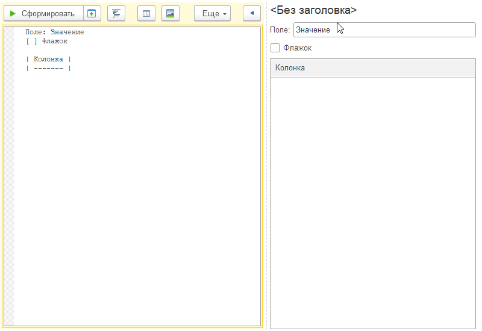

# Работа с программой

## Команды

**Сформировать** - формирует прототип формы.

**Сформировать в отдельном окне** - аналогично предыдущей команде, но прототип формируется в независимом окне.

**Подготовить код** - формирует код для программного создания реквизитов и элементов на форме.

**Форматировать** - выравнивает, добавляет отступы, делает текст красивым.

**Редактор таблицы** - добавляет новую таблицу или изменяет колонки существующей. Открывает [Редактор таблицы](РедакторТаблицы.md).

**Редактор групп** - добавляет, удаляет, менят расположение групп. Открывает окно [Редактор групп](РедакторГрупп.md).

**Добавить картинку** - добавляет представление картинки в текст. Работает пока только для [кнопок](Кнопки.md).

`<>`**Добавить угловые скобки**  - вставляет в текст угловые скобки, которые нужны для описания кнопок.

`[]`**Добавить квадратные скобки**  - вставляет в текст квадратные скобки, описывающие флажок.

`{}`**Добавить квадратные скобки**  - вставляет в текст фигурные скобки, добавляющие свойства.

**Заполнить из формы** - переносит значения полей из формы обратно в текст.

## Сочетания клавиш

| Клавиши      | Описание                   |
| ------------ | -------------------------- |
| Ctrl+Alt+F   | Форматировать текст        |
| Ctrl+Alt+9   | Добавить угловые скобки    |
| Ctrl+Shift+9 | Добавить квадратные скобки |
| Ctrl+9       | Добавить фигурные скобки   |
## Заполнение по форме

Вы можете заполнять реквизиты в форме и переносить их в текст, нажав на кнопку **Заполнить из формы**. Это работает для следующих типов реквизитов: [поле ввода](ПоляВвода.md), [флажок](Флажки.md) и [таблица](Таблицы.md).

<kbd>  </kbd> 
