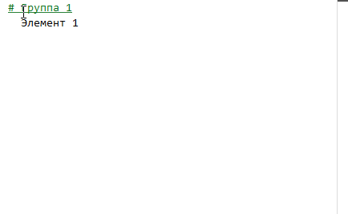

# Редактор групп

При работе с горизонтальными группами не всегда удобно их редактировать. Фокусируйтесь на конкретной группе с помощью Редактора групп.

Зажмите Ctrl и кликните левой кнопкой мыши по нужной группе, чтобы перейти к её редактированию.

<kbd>  </kbd>
