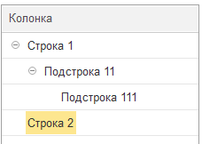
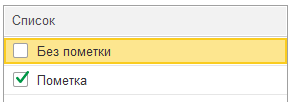
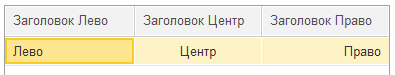
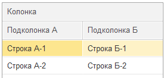
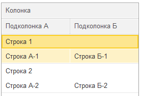

# Таблицы

?> Упростить работу с таблицами можно воспользовавшись [редактором таблиц](РедакторТаблицы.md)

## Таблица
```text
| Колонка 1   | Колонка 2   |
| ----------- | ----------- |
| Ячейка 1.1. | Ячейка 1.2. |
| Ячейка 2.1. | Ячейка 2.2. |
```
Добавляет таблицу на форму. 

## Дерево
Можете также представить данные в виде дерева. Глубина уровней дерева будет определяться количеством точек `.` в начале каждой строки.

```text
| Колонка          |
| ---------------- |
| Строка 1         |
| . Подстрока 11   |
| .. Подстрока 111 |
| Строка 2         |
```

<kbd> </kbd> 

## Флажки в таблице

Можно добавить колонку с флажками, используя символы `[ ]`. 
```text
| Список          |
| --------------- |
| [ ] Без пометки |
| [X] Пометка     |
```
<kbd> </kbd> 

## Горизонтальное выравнивание ячеек

Управляйте горизонтальным выравниванием ячеек, добавляя символ `:` в заголовок таблицы.
```text
| Заголовок Лево | Заголовок Центр | Заголовок Право |
| -------------- | :-------------: | --------------: |
| Лево           |      Центр      |           Право |
```
<kbd> </kbd> 


## Многострочные заголовки
Добавляйте многострочные заголовки.
```text
| -Колонка-                  ||
| Подколонка А | Подколонка Б |
| ------------ | ------------ |
| Строка А-1   | Строка Б-1   |
| Строка А-2   | Строка Б-2   |
```
<kbd>  </kbd> 

## Многоуровневые строки

Это также можно использовать для строк в таблице.
```text
| Колонка                    ||
| Подколонка А | Подколонка Б |
| ------------ | ------------ |
| Строка 1                   ||
| Строка А-1   | Строка Б-1   |
| Строка 2                   ||
| Строка А-2   | Строка Б-2   |
```
<kbd> </kbd> 

## Свойства колонок

| Свойство                | 
| ----------------------- | 
| ГоризонтальноеПоложение | 