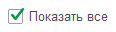
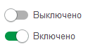

# Флажки
## Флажок
```text
[X] Флажок {ИмяСвойства = ЗначениеСвойства}
```
или</br>
```text
Флажок [] {ИмяСвойства = ЗначениеСвойства}
```
Добавляет поле флажка на форму.

Для признака отметки можно использовать любой символ внутри скобок, при форматировании он будет преобразован в `X`.
```text
[X] Показать все
```
<kbd>  </kbd> 

## Выключатель
Вместо флажка можно использовать выключатель. Для отображения состояний флажка можно использовать любые символы, разделенные символом "|". Символ слева от разделителя соответствует *выключено*, а справа — *включено*.
```text
[0| ] Выключено
[ |1] Включено
```
<kbd>  </kbd> 

## Свойства

| Свойство                       |
| ------------------------------ |
| Заголовок                      |
| ПоложениеЗаголовка             |
| Видимость                      |
| Доступность                    |
| ТолькоПросмотр                 |
| АктивизироватьПоУмолчанию      |
| ВидФлажка                      |
| ЦветТекстаЗаголовка            |
| ЦветРамки                      |
| ГоризонтальноеПоложениеВГруппе |
| ВысотаЗаголовка                |

Для элемента доступны теги [горизонтального положения](ГоризонтальноеПоложение.md).