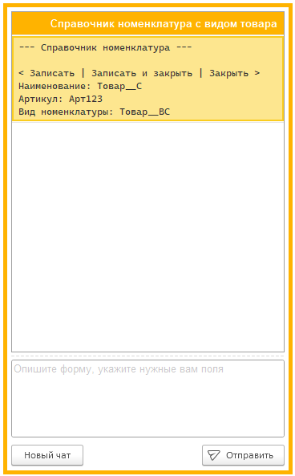

# Чат ИИ

<kbd> </kbd> 

Чат с искусственным интеллектом, в котором пользователь может вводить сообщения и получать прототипы форм в ответ. Двойной щелчек мыши переносит его в редактор.

Вот краткая информация о его элементах:
* **Новый чат**: Начинает новый сеанс чата с ИИ, очищает историю сообщений.
* **Отправить**: Отправляет введенное сообщение ИИ для обработки.

?> Команда контекстного меню чата **Заменить на текст из редактора** позволяет заменить выбранную строку на текст из редактора.Это бывает полезно, чтобы направить ИИ.
